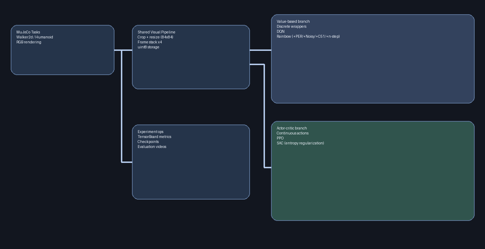
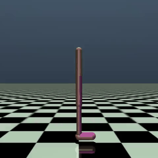
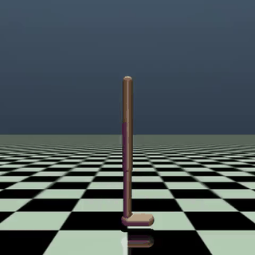
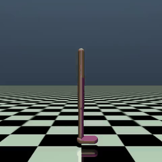
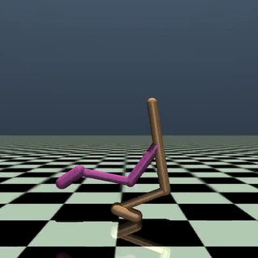
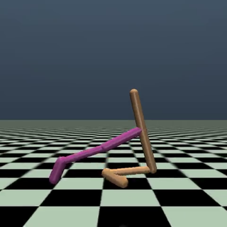
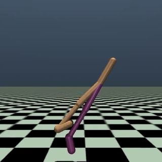
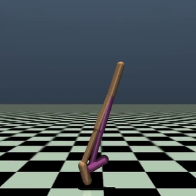
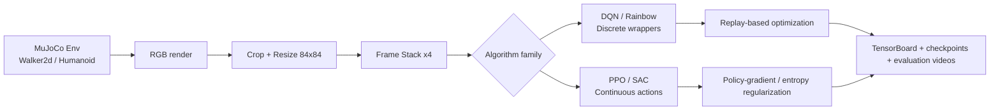
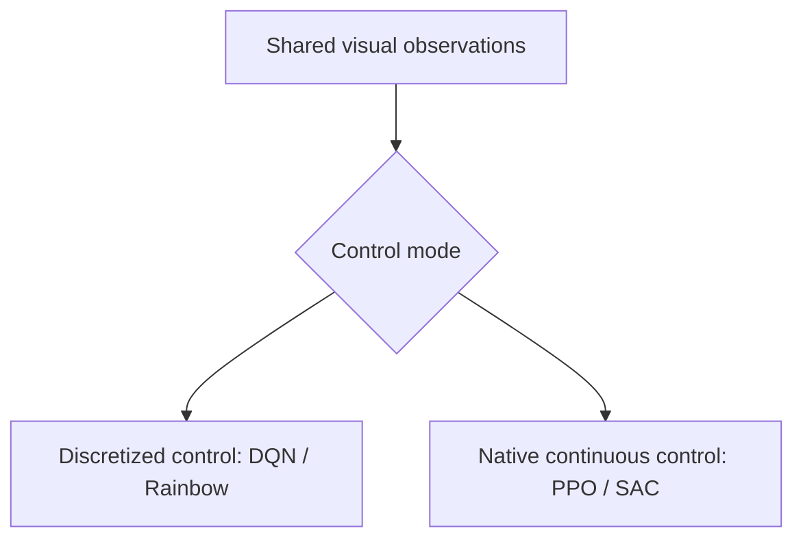

# DeepRL Algorithms — From Pixels to Locomotion

<p align="left">
  Unified Deep Reinforcement Learning project comparing value-based and actor-critic methods for MuJoCo locomotion from RGB observations.
</p>

<p align="left">
  
  
  
  
  
</p>

---

## Overview

This repository is presented as **one unified Deep RL project** where we implement and compare:

- **DQN**
- **Rainbow**
- **PPO**
- **SAC**

All methods target the same general challenge: **visual locomotion in MuJoCo from RGB frames**, with a consistent preprocessing pipeline and experiment workflow.

---

## Project highlights

<p align="center">
  
</p>

The project focuses on practical challenges that usually decide real RL performance:

- Learning directly from **pixel observations**
- Dealing with **continuous control** under two paradigms
- Using **reward shaping** to improve stability
- Comparing value-based and actor-critic behavior under shared conditions

---

## Visual showcase

### Training runs (GIF previews)

<table>
  <tr>
    <td align="center"><b>DQN</b></td>
    <td align="center"><b>Rainbow</b></td>
  </tr>
  <tr>
    <td></td>
    <td></td>
  </tr>
  <tr>
    <td align="center"><b>PPO</b></td>
    <td align="center"><b>SAC</b></td>
  </tr>
  <tr>
    <td></td>
    <td></td>
  </tr>
</table>

### Algorithm cards

<p align="center">
  
  
  
  
</p>


---

## Algorithms implemented

| Algorithm | Family | Role in this project | Key implementation details |
|---|---|---|---|
| **DQN** | Value-based | Baseline for discretized visual control | Replay buffer, target network, epsilon-greedy |
| **Rainbow** | Enhanced value-based | Stronger DQN variant on the same setup | PER, Noisy Nets, C51, n-step returns, dueling/double options |
| **PPO** | On-policy actor-critic | Native continuous-control baseline | Clipped objective + GAE on visual observations |
| **SAC** | Off-policy actor-critic | High-performance continuous baseline | Stochastic actor, twin critics, entropy temperature tuning |

---

## Unified pipeline

### Shared flow

1. MuJoCo environment (`Walker2d` / `Humanoid`)
2. RGB rendering (`render_mode="rgb_array"`)
3. Crop + resize (`84x84`)
4. Frame stacking (`x4`)
5. Optional reward shaping
6. Branch:
   - **Value-based path**: discretization wrappers + DQN/Rainbow
   - **Actor-critic path**: native continuous actions + PPO/SAC



### Value-based vs actor-critic split



---

## Repository structure (real paths)

```text
DeepRL_algorithms/
├── README.md
├── requirements.txt
├── scripts/
│   └── generate_media.py
├── Reports/
│   ├── DQN_Rainbow.pdf
│   └── MUIA_P3.pdf
├── videos/
│   ├── walker_train_dqn_new_walker-episode-70000.mp4
│   ├── walker_train_rainbow-episode-35000.mp4
│   ├── walker_train_rainbow_noPER-episode-44000.mp4
│   ├── walker_train_rainbow_noDIST-episode-162000.mp4
│   ├── walker_train_rainbow_noPER_noDIST-episode-166000.mp4
│   ├── ppo_original_experiment_result.mp4
│   └── sac_original_experiment_result.mp4
└── src/
    ├── config.py
    ├── utils.py
    ├── agents/
    │   ├── dqn/
    │   ├── rainbow/
    │   ├── ppo/
    │   └── sac/
    ├── environments/
    ├── train/
    │   ├── train_dqn.py
    │   ├── train_rainbow.py
    │   ├── train_ppo_cont.py
    │   ├── train_sac_cont.py
    │   ├── train_ppo_cont_optuna.py
    │   ├── train_sac_cont_optuna.py
    │   └── resume_checkpoint.py
    └── evaluate/
        ├── evaluate_dqn.py
        ├── evaluate_rainbow.py
        └── evaluate_sac_cont.py
```

---

## Visual results (project videos)

| Algorithm | Video artifact |
| --------- | -------------------------------------------------------------------------------------------------------------- |
| DQN       | [`videos/walker_train_dqn_new_walker-episode-70000.mp4`](videos/walker_train_dqn_new_walker-episode-70000.mp4) |
| Rainbow   | [`videos/walker_train_rainbow-episode-35000.mp4`](videos/walker_train_rainbow-episode-35000.mp4)               |
| PPO       | [`videos/ppo_original_experiment_result.mp4`](videos/ppo_original_experiment_result.mp4)                       |
| SAC       | [`videos/sac_original_experiment_result.mp4`](videos/sac_original_experiment_result.mp4)                       |

### Rainbow ablation videos

* [`videos/walker_train_rainbow_noPER-episode-44000.mp4`](videos/walker_train_rainbow_noPER-episode-44000.mp4)
* [`videos/walker_train_rainbow_noDIST-episode-162000.mp4`](videos/walker_train_rainbow_noDIST-episode-162000.mp4)
* [`videos/walker_train_rainbow_noPER_noDIST-episode-166000.mp4`](videos/walker_train_rainbow_noPER_noDIST-episode-166000.mp4)

### Optional: generate `docs/media/` locally (banner, GIFs, thumbnails)

If you want rich visual assets in your local clone, run:

```bash
pip install imageio pillow
python scripts/generate_media.py
```

This will create assets such as `banner.png`, `architecture_overview.png`, `*_run.gif`, and `rainbow_ablations.png` under `docs/media/`.

---

## Results / key findings

| Finding | Evidence in repository |
| -------------------------------------------------------------------------------------------- | ------------------------------------------------------------------------------------ |
| Rainbow is tested with explicit component ablations | `noPER`, `noDIST`, `noPER_noDIST` video runs |
| Value-based methods are adapted to continuous tasks through discrete wrappers | `DiscreteWalkerWrapper` and `DiscreteHumanoidWrapper` + DQN/Rainbow training scripts |
| PPO and SAC are integrated as native continuous baselines with the same pixel input strategy | `train_ppo_cont.py` and `train_sac_cont.py` |
| The project is experiment-oriented and reproducible | Shared config, TensorBoard logging, checkpoints, and evaluation scripts |

---

## What this project demonstrates

* Deep RL implementation across different algorithm families
* MuJoCo locomotion with visual inputs
* Practical design of replay and actor-critic training loops
* Reward shaping and training-stability engineering
* Comparative experimentation and ablation mindset

---

## Reproducibility / usage

> Commands below map to scripts currently present in this repository.

### Install

```bash
pip install -r requirements.txt
```

### Train

```bash
# Value-based
python src/train/train_dqn.py --task walker
python src/train/train_rainbow.py --task walker

# Continuous actor-critic
python src/train/train_ppo_cont.py --task walker --use_shaping
python src/train/train_sac_cont.py --task walker --use_shaping
```

### Evaluate

```bash
python src/evaluate/evaluate_dqn.py
python src/evaluate/evaluate_rainbow.py
python src/evaluate/evaluate_sac_cont.py --task walker
```

### Main outputs

* `checkpoints/<env>/<algo>/`
* `results/<env>/<algo>/`
* `videos/<env>/<algo>/...`

---

## Future work

* Multi-seed evaluation with confidence intervals
* Unified benchmark tables across all algorithms
* Additional MuJoCo tasks and harder visual settings
* Better representation learning for pixel-based control
* End-to-end automated experiment reporting

---

## Authors

* Antonio Lorenzo
* Andrés Martínez
* Pablo García
